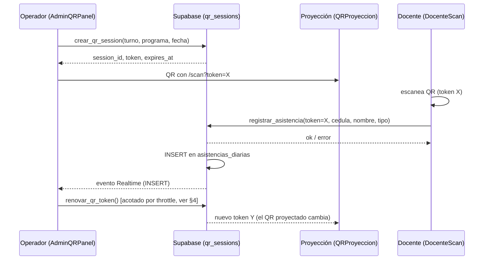

# 🕒 Flujo de Asistencias QR — Guía técnica

Documentación del módulo de asistencias por código QR: cómo funciona hoy,
componentes involucrados, ciclo de vida del token, y el fix de rendimiento/UX
aplicado en la auditoría de 2026 (throttle de rotación).

> **Alcance:** este documento cubre el flujo de *entrada/salida de docentes*
> vía `/scan`, no el resto del sistema de horarios. Para roles y permisos
> generales ver `SECURITY.md`.

---

## 1. Componentes involucrados

| Archivo | Rol |
|---|---|
| `src/hooks/useQRSession.js` | Hook que vive en `App.jsx`. Gestiona el ciclo de vida completo de la sesión QR: creación, countdown, rotación del token, recuperación tras recarga. |
| `src/components/asistencias/AdminQRPanel.jsx` | Panel del admin/`operador_qr`: configura turno/programa/fecha, inicia/cierra la sesión, muestra el QR, el feed de actividad y el contador de entradas/salidas. |
| `src/components/asistencias/QRProyeccion.jsx` | Vista de solo-proyección (pantalla/proyector del aula) — el QR y las instrucciones, nada de controles administrativos. |
| `src/components/asistencias/DocenteScan/index.jsx` | Página pública que abre el docente al escanear (`/scan?token=...`). Sin sesión Supabase, acceso anónimo. |
| `supabase/migrations/0006_modulo_asistencias_qr.sql` | Esquema (`qr_sessions`, `asistencias_diarias`) y RPCs base (`crear_qr_session`, `renovar_qr_token`, `registrar_asistencia`). |
| `supabase/migrations/0039_rate_limit_scan.sql` | Rate limiting por `device_fingerprint` sobre `registrar_asistencia`. |

---

## 2. Flujo end-to-end



### 2.1 Docente recurrente (ya escaneó antes en este dispositivo)

1. Escanea → la app valida que el token corresponde a una sesión **de hoy**
   (evita mostrar datos de un docente anterior en el mismo dispositivo).
2. Ve sus datos guardados (`localStorage`) y solo confirma Entrada/Salida.
3. Un solo tap → `registrar_asistencia` → resultado.

### 2.2 Docente primerizo (o cambió de dispositivo)

1. Escanea → formulario de cédula + nombre.
2. Autocompletado: busca primero en `docentes` (catálogo de horarios) y si
   no está vinculado, en el último registro que ese mismo docente haya hecho
   en `asistencias_diarias` (debounce de 450 ms).
3. Pantalla de verificación de datos ("un número equivocado te registra como
   otra persona") antes de confirmar.
4. Al confirmar con éxito, los datos quedan guardados localmente para la
   próxima vez.

---

## 3. Ciclo de vida del token

El TTL configurado es de **5 minutos**, pero en la práctica el token rota por
tres vías independientes — el TTL es el techo, no la cadencia real:

| Disparador | Mecanismo | Immediatez |
|---|---|---|
| **Escaneo exitoso** (uno o varios) | Suscripción Realtime a `INSERT` en `asistencias_diarias` | Pasa por el **throttle** (§4) |
| **Respaldo por si Realtime falla** | Poll cada 7s que compara el conteo de registros de la sesión | Pasa por el mismo throttle |
| **Vencimiento de TTL** | `setInterval` que renueva 15s antes de `expires_at` | Inmediato, sin throttle |
| **Manual** | Botón "Regenerar QR ahora" en `AdminQRPanel` | Inmediato, sin throttle |

La rotación no es "agregar un token válido más": `renovar_qr_token` hace
`UPDATE qr_sessions SET token = nuevo`, sobre una columna `UNIQUE`. El token
anterior deja de existir — no hay ventana de gracia a nivel de base de datos.
`registrar_asistencia` busca `WHERE token = p_token`; si ya rotó, no hay
match y devuelve `TOKEN_INVALIDO`.

---

## 4. Fix: throttle de rotación por escaneo (auditoría 2026)

### 4.1 El problema

Antes de este fix, **cada** escaneo exitoso rotaba el token al instante. En
hora pico (varios docentes escaneando el mismo QR casi a la vez), el primer
registro exitoso invalidaba el token para todos los que seguían a mitad del
formulario. Consecuencias:

- Docentes recurrentes: mensaje de "vuelve a escanear" — molesto pero
  rápido de resolver (sus datos ya estaban guardados localmente).
- Docentes primerizos: si perdían la carrera, no había pantalla de
  recuperación equivalente — reescribían cédula y nombre desde cero,
  compitiendo otra vez contra el siguiente escaneo.
- Cada intento fallido por token viejo también consume una unidad del
  rate limit por `device_fingerprint` (10 intentos/hora) — una ráfaga de
  colisiones podía acercar a un docente al bloqueo sin que hubiera hecho
  nada indebido.

### 4.2 La solución

`useQRSession.js` — throttle con **trailing edge** sobre las dos fuentes de
"rotar porque hubo un escaneo" (Realtime y el poll de respaldo). La rotación
por TTL y la manual **no** pasan por el throttle; siguen siendo inmediatas.

```js
const ROTACION_ESCANEO_MIN_INTERVALO_MS = 12000; // 12s
```

Comportamiento:

1. Si ya pasaron 12s desde la última rotación por escaneo → rota de
   inmediato (caso normal, un solo docente escaneando).
2. Si no, y no hay ya una rotación pendiente agendada → agenda **una sola**
   rotación para el tiempo que falte hasta completar los 12s. Si llegan más
   escaneos mientras tanto, no se agenda un timer nuevo por cada uno — se
   reutiliza el mismo trailing.

Esto da dos garantías:

- **Cota superior:** ningún token dura más de ~12s de actividad sin rotar,
  aunque haya una ráfaga continua — el conteo nunca se reinicia con cada
  evento nuevo (evita el problema típico de un debounce puro, que puede
  posponerse indefinidamente si el tráfico no para).
- **Cota inferior:** sin actividad, no hay timers de fondo corriendo.

### 4.3 Trade-off de seguridad (explícito, no accidental)

La rotación por escaneo existe para invalidar rápido una foto del QR
reenviada por chat. Antes: inútil en milisegundos tras el primer escaneo
legítimo. Ahora: puede seguir siendo válida hasta 12s más en el peor caso.
Frente a un TTL base de 5 minutos, esos 12s adicionales no cambian el
modelo de amenaza real (fotos reenviadas minutos u horas después) — solo
angosta ligeramente la ventana de reutilización inmediata, que ya era
estrecha.

### 4.4 Lo que este fix *no* resuelve

- La primera colisión de cada sesión (t=0, cuando `ultimaRotacionEscaneoRef`
  arranca en 0) sigue rotando al instante — caso poco común en la práctica
  (rara vez hay ya una fila de docentes en el primer segundo de una sesión
  recién creada).
- Un docente que escanea justo antes de que se cumpla la ventana de 12s y
  confirma después de que ya rotó, todavía puede perder la carrera. La
  pantalla de "solo reescanea" (docentes recurrentes) sigue siendo la red
  de seguridad para ese caso.
- El caso de **primerizos** que pierden la carrera sigue sin pantalla de
  recuperación dedicada — el throttle reduce la frecuencia del problema,
  no lo elimina. Queda pendiente (ver §5).

---

## 5. Pendientes evaluados

| Propuesta | Estado | Motivo |
|---|---|---|
| Persistir datos de un primerizo mientras espera el reescaneo, para no perder cédula/nombre tecleados | **Pendiente**, prioridad media | Requiere una clave de `localStorage` separada de la de "registro confirmado", para no contaminar la lógica de `avisoStale` ni la detección de docente recurrente. Menos urgente ahora que el throttle bajó la frecuencia de colisiones. |
| Ventana de gracia real en el token (aceptar el penúltimo token unos segundos) | **Evaluada y descartada por ahora** | Toca `registrar_asistencia` y `renovar_qr_token` (RPCs `SECURITY DEFINER` con acceso anónimo) — zona de mayor riesgo del sistema. No cubre bien ráfagas de 3+ rotaciones seguidas (cada rotación nueva pisa la gracia de la anterior). Se reconsiderará solo si el throttle actual resulta insuficiente en uso real. |

---

## 6. Códigos de resultado de `registrar_asistencia`

| Código | Significado | Requiere reescaneo* |
|---|---|:---:|
| `ok` | Registro exitoso | — |
| `OFFLINE` | Guardado localmente, pendiente de sincronizar | — |
| `YA_REGISTRADO` / `YA_REGISTRADO_SALIDA` | El docente ya marcó ese tipo hoy | No |
| `SIN_ENTRADA_PREVIA` | Intenta marcar salida sin entrada previa el mismo día | No |
| `TOKEN_INVALIDO` | El token no existe (ya rotó, o QR ajeno) | **Sí** |
| `TOKEN_EXPIRADO` | Token vencido por TTL | **Sí** |
| `SESION_FECHA_INVALIDA` | Token de una sesión de otro día | **Sí** |
| `SESION_INACTIVA` | El operador cerró la sesión | No |
| `DEVICE_DUPLICADO` | El mismo dispositivo ya se usó para otra cédula en esta sesión | No |
| `RATE_LIMIT` | Más de 10 intentos/hora desde ese `device_fingerprint` | No |

\* "Requiere reescaneo" = la app muestra la pantalla amable de "vuelve a
escanear, tus datos ya están confirmados" en vez del error genérico —
solo disponible hoy para docentes con datos guardados localmente (ver §5).

---

*Última actualización: julio 2026 — auditoría de seguridad y calidad de
código de SIGMA PNF.*
